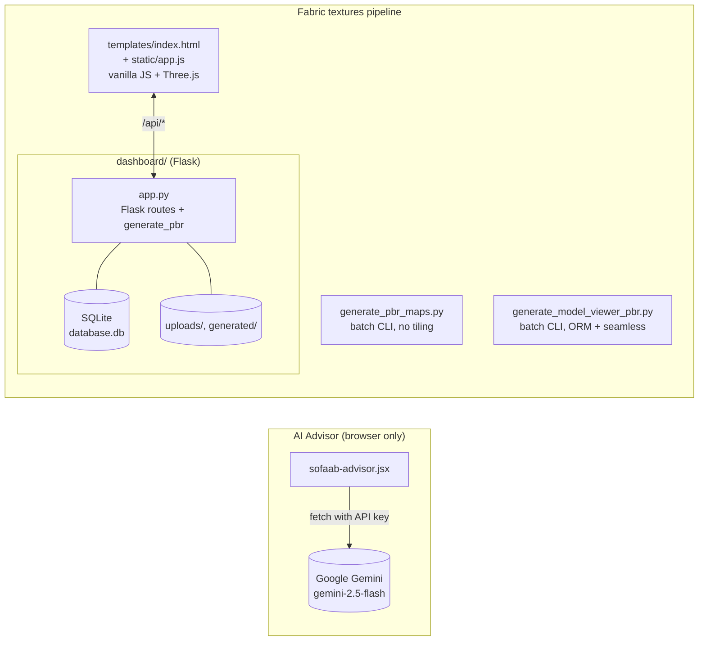
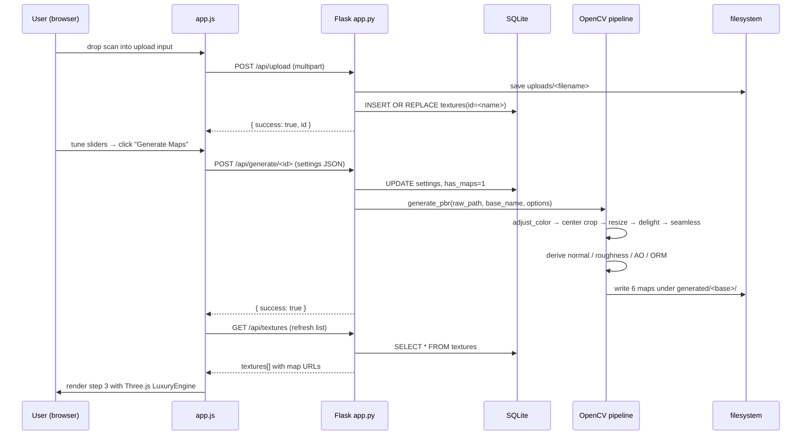

# Architecture Guide

<!-- AUTO-GENERATED START -->

Detailed system overview for SOFAAB Studio. Supplementary to `@.claude/rules/architecture.md` — read that first for the lean version.

## Components



The two CLI scripts and the dashboard's `generate_pbr()` share the same algorithmic skeleton. The dashboard is the most evolved variant (adds delighting, parameterised settings, mirror tiling).

## Folder structure

```
SOFAABstudio/
├── CLAUDE.md                       # primary context (lean)
├── CLAUDE.local.md                 # personal context (gitignored)
├── .gitignore
├── .claude/
│   ├── settings.json               # shared project settings
│   └── rules/                      # topic-scoped context
│       ├── architecture.md
│       ├── python.md
│       ├── security.md
│       └── workflows.md
├── docs/                           # supplementary (not auto-loaded)
│   ├── architecture-guide.md
│   ├── api-reference.md
│   └── workflow-diagrams.md
├── sofaab-advisor.jsx              # standalone React component (Gemini chat)
└── fabric textures/
    ├── generate_pbr_maps.py        # CLI: basic PBR set
    ├── generate_model_viewer_pbr.py# CLI: seamless ORM-packed PBR
    └── dashboard/
        ├── app.py                  # Flask + SQLite + PBR generation
        ├── templates/index.html    # SPA shell
        └── static/
            ├── app.js              # vanilla JS + Three.js LuxuryEngine
            ├── index.css
            ├── sample_model.glb    # default model
            ├── studio_hdri.jpg
            ├── studio_lighting.jpg
            ├── studio_lighting_v2.jpg
            └── studioformodels.hdr
```

## Tech stack

| Layer | Tech | Notes |
|---|---|---|
| Backend | Flask | Single `app.py`, `debug=True`, port 8081 |
| Image processing | OpenCV (`cv2`) + numpy | BGR channel order; Sobel for normals; Gaussian for AO |
| Storage | SQLite (`database.db`) + filesystem | Per-asset directories under `generated/` |
| Frontend | Vanilla JS + Three.js 0.160.0 | ESM importmap via unpkg, no bundler |
| 3D format | glTF (`.glb`) + ORM-packed PBR | `<model-viewer>` compatible |
| AI Advisor | React + Google Gemini API | Standalone JSX file, no build pipeline |
| Python | 3.12+ | No `requirements.txt` yet — install ad-hoc |

## End-to-end request flow (dashboard)



## PBR generation pipeline (inside `generate_pbr`)

```mermaid
flowchart TB
  raw[Raw scan BGR] --> adj[adjust_color\nbrightness/contrast/hue/sat]
  adj --> crop[Center crop\nsafe 60% × (1 - edge_crop)]
  crop --> resize[Resize to N×N\nINTER_AREA]
  resize --> delight[delight_image\nhigh-pass dual sigma blur]
  delight --> seam{mirror_tiling?}
  seam -->|yes| mirror[2×2 mirrored grid\nresize back to N×N]
  seam -->|no| sigmoid[Sigmoid blend with\n50% rolled offset]
  mirror --> albedo[Albedo = seamless copy]
  sigmoid --> albedo
  albedo --> gray[grayscale]
  gray --> sobel[Sobel ∂x, ∂y]
  sobel --> normal[Normal map\nBGR = (Z, -Y, X) normalised]
  gray --> rough[Roughness\nnormalize(255-gray, 120..240)]
  gray --> ao[AO = gray / GaussianBlur(gray)\nnormalize + gamma 2.0]
  rough --> orm[ORM stack\nB=metallic(0), G=rough, R=ao]
  ao --> orm
  albedo --> out[(generated/<base>/)]
  normal --> out
  rough --> out
  ao --> out
  orm --> out
```

<!-- AUTO-GENERATED END -->
