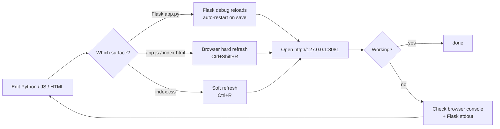
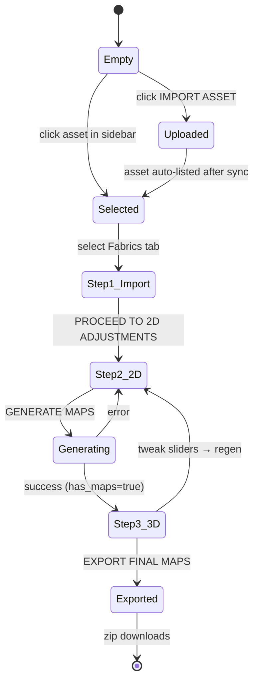
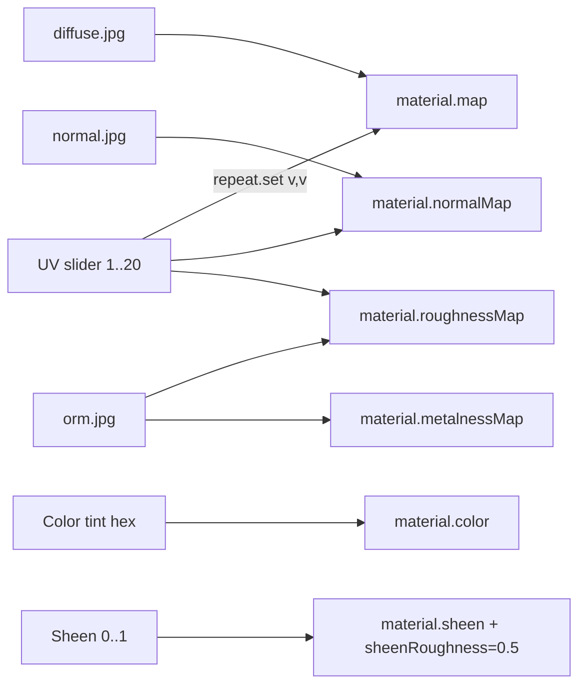
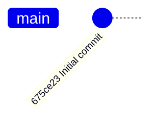

# Workflow Diagrams

<!-- AUTO-GENERATED START -->

Pipelines and dev flows. Supplementary to `@.claude/rules/workflows.md`.

## Dev loop



## User journey through the dashboard



## PBR generation decision tree

```mermaid
flowchart TB
  start[Click GENERATE MAPS] --> save_db[Write all sliders to SQLite\n(BEFORE running generation)]
  save_db --> load[cv2.imread raw upload]
  load --> ok{Loaded ok?}
  ok -->|no| err1[Return 500\nrow already updated]
  ok -->|yes| color[adjust_color]
  color --> crop[Center crop to 60% × 1-edge_crop]
  crop --> resize[Resize to N×N]
  resize --> delight[delight_image\nremoves global+local gradients]
  delight --> tile{mirror_tiling true?}
  tile -->|yes| mirror[2×2 mirrored grid + downscale]
  tile -->|no| sigmoid[Sigmoid sequence at 50% offset]
  mirror --> derive
  sigmoid --> derive
  derive[Derive normal/roughness/AO from grayscale]
  derive --> orm[Pack ORM and Metallic-Roughness textures]
  orm --> write[Write 6 jpgs under generated/<base>/]
  write --> ret[Return success]
```

## Map dependency graph

Used by the Three.js `LuxuryEngine` (`static/app.js:331`):



## Branching / commits



Currently single-branch (`main`) with one commit. No branching strategy formalised yet. When opening PRs, target `main`.

<!-- AUTO-GENERATED END -->
